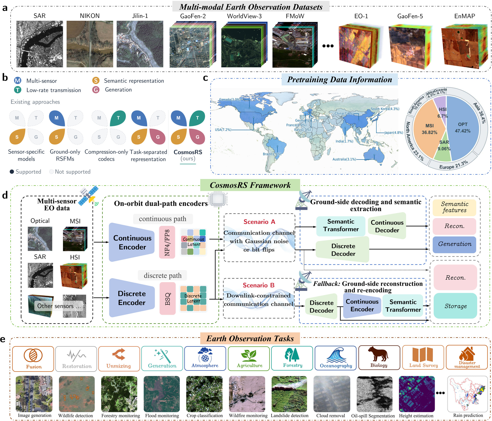

# CosmosRS: A Dual-Path Foundation Framework for Bandwidth-Constrained Earth Observation

Zi-Han Cao, Yu-Jie Liang, Dong-Chen Wang, Jin-Liang Shao, Tun Wang, Ting-Zhu Huang, Jón Atli Benediktsson, Danfeng Hong, Antonio Plaza, Gemine Vivone, and Liang-Jian Deng

  

**Overview of CosmosRS.** (a) Representative optical, SAR, multispectral and hyperspectral data sources. (b) Capabilities of existing Earth observation pipelines and of CosmosRS. (c) Geographic coverage and modality composition of the 40-million-sample pretraining corpus. (d) Dual-path framework: lightweight on-orbit encoders emit a continuous latent or a discrete latent, which is sent to the ground for decoding, semantic feature extraction and generation. (e) Evaluation tasks spanning physical restoration and fusion, hyperspectral analysis, conditional generation, and high-level interpretation across seven Earth observation scientific domains.

## Abstract

Earth observation (EO) provides essential information for environmental monitoring and scientific discovery, but its utility depends on efficiently transmitting heterogeneous sensor measurements while preserving the information required for analysis. Existing approaches typically address compression, physical restoration, semantic interpretation, and conditional generation independently, leaving communication constraints disconnected from EO pipeline design.

We present **CosmosRS**, a multi-sensor EO foundation framework that integrates bandwidth-limited transmission with physically faithful reconstruction, transferable interpretation, and conditional generation. We curate a 40-million-sample pretraining corpus spanning optical, synthetic aperture radar, multispectral and hyperspectral observations. To accommodate the competing requirements of compact transmission and information-rich modeling, CosmosRS adopts two separately optimized latent pathways:

- **CosmosRS-Compress**, a discrete pathway that produces compact codes for transmission and reconstruction.
- **CosmosRS-Semantic**, a continuous pathway that preserves spatial, spectral and semantic structure for restoration, interpretation and synthesis.

A band-adaptive interface accommodates heterogeneous spectral configurations, and lightweight encoders connect sensor-side processing with ground-side computation. Under tighter bandwidth constraints, compressed reconstructions can be processed by the frozen backbone, preserving access to downstream analysis without transmitting the richer continuous latents.

Across 15 task types, 16 datasets and seven EO scientific domains, the continuous pathway ranks first on all high-level interpretation metrics. With the same pretrained backbone, it also surpasses dedicated methods in physical restoration and hyperspectral analysis and improves conditional optical and hyperspectral generation. The discrete pathway is competitive with conventional and learned codecs and, on multispectral and hyperspectral data, reconstructs more faithfully at lower bitrates. Applied to these reconstructions without retraining, the frozen backbone retains most of the downstream accuracy. Both latent representations degrade gradually under simulated bit errors and channel noise. Proof-of-concept studies show methane-plume detection from compressed observations and parameter-efficient transfer to Martian mineral mapping.

## Release

Code, pretrained weights and instructions for reproducing the main experiments are **coming soon**.

- [ ] Model definitions for CosmosRS-Semantic and CosmosRS-Compress
- [ ] Pretrained weights
- [ ] Training and evaluation scripts
- [ ] Downstream task heads and benchmark configurations

## Contact

For questions, please contact Liang-Jian Deng (liangjian.deng@uestc.edu.cn).
